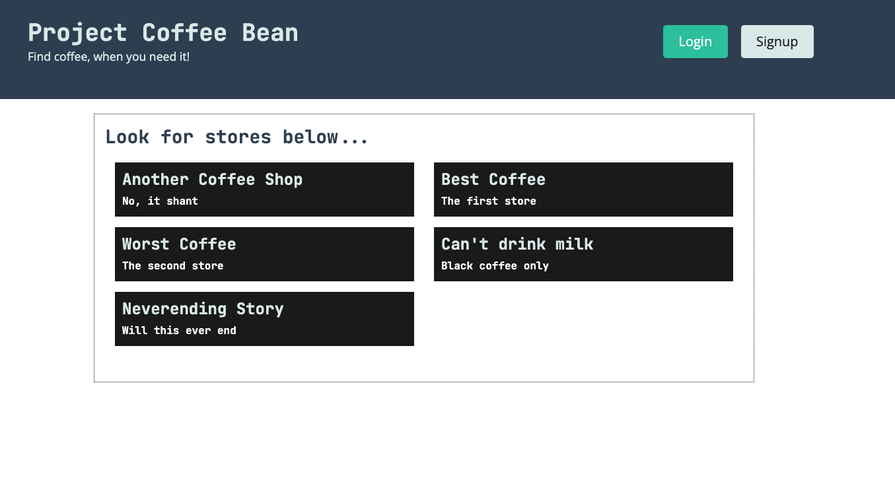
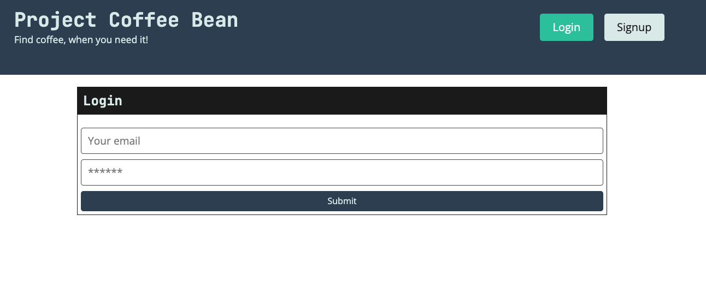

# Project Coffee Bean

## The Problem
Take this scenario, it is 3pm, you've been in meetings all day and haven't had an opportunity to get your second coffee all day. You approach your favourite cafe and are devestated to find out its closed.
In this project we aim to create an application to allow you to find a place to get coffee when times seem dire, with most cafes and coffee stores closing after the morning rush, it can be difficult to find that last minute cup of joe. 

## Outcomes
This project allowed me to learn more about the following;
- Javascript implimentation and use
- Express implimentation and use
- MongoDB and Atlas deployment
- Heroku deployment
- React frontend development
- Backend to Frontend connections

## Installation

This project is deployed on Heroku and can be accessed through the following link: https://project-coffeebean.herokuapp.com/
This application can be used as a web application through the deployment link, or run locally by cloning the repo and serving it from a build, or running `npm run develop`.

## Usage

This application is proof of concept, it can be used to view a list of coffee stores, login and logout securely.
To test the login for yourself, please use the below details;

- Username: oliver.kelly@mail.com
- Password: Password123

## Some Comments
Unfortunately, during the production of this MVP, I contracted COVID to quite a serious degree and was unable to complete my original vision for the app. In this manner I have refactored some boiler plate code to show a proof of concept for the application. It is my intention to progress this app to a functional version over time however.

## Credits

This project was done in conjunction with the University of Sydney and Trilogy Education through their collaborated full stack bootcamp program.

---
